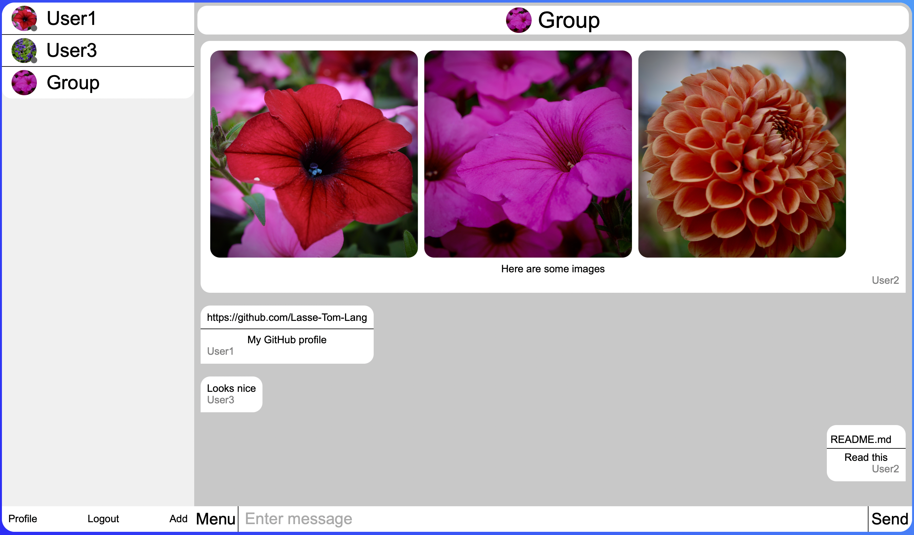

# node.js chat app



# Setup

## Manual

### Server
First, run `npm install` in the server directory.
Then you can start the server by running `node .` in the server directory.

### Database
You have to run a database like MySQL.
Then configure a `.env` file in the server directory by following the `.env.example` file.
If you are not using MySQL and a database called db, change this
``` 
  datasource db {
    provider = "mysql"
    url      = env("DATABASE_URL")
  }
```
in `/server/prisma/schema.prisma`.
Then run `npx prisma migrate dev` and `npx prisma generate` in the server directory.

---

## Docker

You can also just run `docker-compose up` in the main directory, if you have installed Docker.